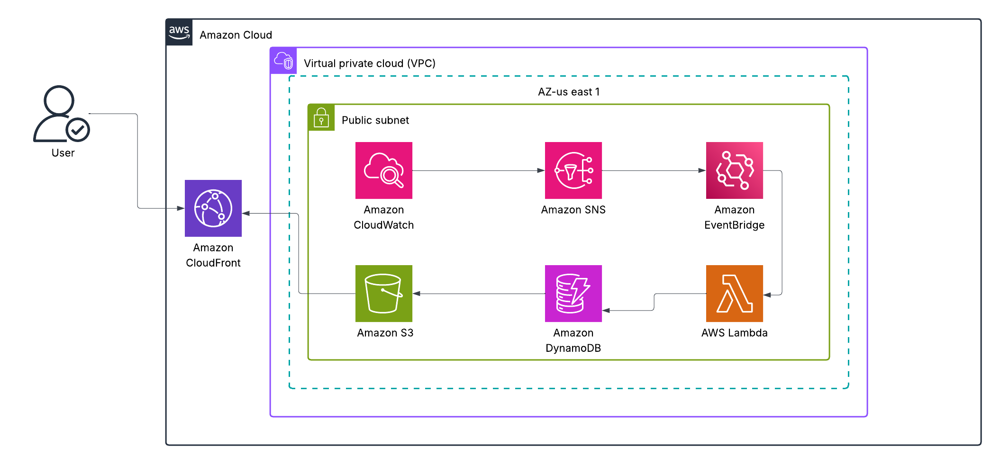

# CWA Academy Test: Cloud Cost Tracker & Alert System (Terraform Only)

## 📌 Project Overview
This project provisions a **Cloud Cost Tracker & Alert System** on AWS using **Terraform only**.  
It monitors AWS billing, logs cost data, and sends alerts when thresholds are exceeded.  
It also includes a simple web dashboard served via **S3 + CloudFront**.

---

## ⚙️ Architecture
The system consists of:
- **DynamoDB Table** → Stores cost logs.
- **CloudWatch Billing Metric + Alarm** → Monitors estimated AWS costs.
- **SNS Topic & Subscription** → Sends cost alerts to email.
- **Lambda Function (cost_logger)** → Writes AWS billing data into DynamoDB.
- **EventBridge Rule** → Schedules Lambda execution.
- **API Gateway + Lambda** → Exposes DynamoDB data as REST API.
- **S3 + CloudFront** → Hosts a static frontend dashboard to visualize costs.

📌 **Architecture Diagram:**  
 Also in /screenshots folder

---

## 🚀 Steps I Took
1. Set up Terraform project with `main.tf`, `dynamodb.tf`, `lambda.tf`, `sns.tf`, `cloudwatch.tf`, `api.tf`, `frontend.tf`.
2. Created DynamoDB table (`cost-tracker-logs`).
3. Deployed Lambda (`cost_logger`) to write logs into DynamoDB.
4. Configured CloudWatch Alarm + SNS to send alerts to email.
5. Exposed DynamoDB logs via API Gateway + Lambda.
6. Hosted frontend dashboard on **S3 + CloudFront**.
7. Tested everything with lowered billing threshold (`$0.01`) and manual Lambda invocation.

---

## 📷 Screenshots
Screenshots available in `/screenshots` folder:
- DynamoDB Table
- Lambda Function
- SNS Subscription
- CloudWatch Alarm
- API Gateway
- S3 + CloudFront
- Terraform Apply output

---

## ⚠️ Challenges Faced
- **Provider errors** (STS authentication issues) → fixed by reconfiguring AWS credentials.  
- **Lambda packaging** → zipped correctly with `Compress-Archive` on Windows.  
- **S3 public access errors** → solved by using bucket ownership + proper CloudFront config.  
- **Git push large files issue** → solved by removing `.terraform` folder before committing.  

---

## 🎯 Lessons Learned
- End-to-end **Terraform IaC** deployment with no console clicks.  
- How AWS billing alerts are tied to **real billing metrics**.  
- Importance of IAM permissions for Lambda and DynamoDB.  
- GitHub repo structuring with Terraform + Lambda + Frontend code.  

---

## ✅ Testing
- Lowered alarm threshold to `$0.01` to trigger email quickly.  
- Manually invoked Lambda → confirmed new log entry in DynamoDB.  
- Opened CloudFront URL → dashboard loaded successfully.  

---

## 🔗 Medium Reflection Post
[My Medium Post](https://medium.com/@ukpainnachi995/building-a-cloud-cost-tracker-alert-system-with-terraform-9d06fa58d6ca)
